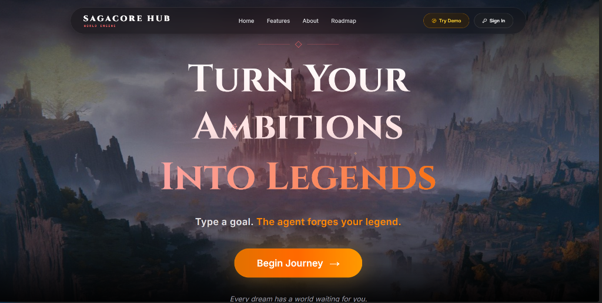

# SAGACORE HUB

> Type a goal. An AI agent reads your game state, plans a 3-quest
> campaign, and writes it to MongoDB — autonomously.
> No JSON parsing. No manual saves. The agent does it all.



---

## Try It Now — No Sign Up Needed

Visit **[saga-core.vercel.app](https://saga-core.vercel.app)** and click **Try Demo** for an instant sandboxed guest session with pre-filled quests, zero credentials required.

---

## What Is SagaCore?

SagaCore is an autonomous AI agent disguised as a productivity app.

Instead of a to-do list, you get a living fantasy world. Every goal becomes a quest campaign. Every completion shapes your realm's lore. Every streak builds your rank — from Neophyte Scribe all the way to Grand Sage Paragon.

But underneath the fantasy skin is a real agentic system: Gemini reads your database state, reasons about your level and active quests, plans a sequential 3-part campaign, and writes all three quests to MongoDB using function calling — without you touching a single line of state management.

---

## Why This Is Agentic

This is the distinction that matters:

| Standard LLM App | SagaCore Agent |
|---|---|
| Prompt → JSON text → app saves to DB | Prompt → agent reads DB → reasons → agent writes to DB |
| Single-turn response | Multi-turn ReAct loop (up to 5 iterations) |
| App controls all state | Agent autonomously decides what to read and write |
| One output | Chained tool calls with intermediate results fed back |

The agent does not answer questions. It acts on a live database.

---

## The Agent in Action

You type: *"master graph traversal algorithms"*

```
User submits ambition
  → Agent calls getRealmState        (reads player XP, level, active quests)
  → Agent reasons about current state
  │  → Agent calls saveQuestToDatabase  (Quest 1: Wisdom — learn the theory)
  │  → Agent calls saveQuestToDatabase  (Quest 2: Creation — implement it)
  │  → Agent calls saveQuestToDatabase  (Quest 3: Discipline — solve 5 problems)
  → Agent returns full campaign summary
```

Quest 2 is locked until Quest 1 is complete.
Quest 3 is locked until Quest 2 is complete.
The agent enforces a real progression arc — not a flat list.

---

## Agent Tools

Gemini decides when and which tools to call:

| Tool | What It Does |
|---|---|
| `getRealmState` | Reads player XP, level, and active quests before reasoning |
| `saveQuestToDatabase` | Writes a fully structured quest directly to MongoDB |
| `saveChapterToDatabase` | Inscribes a lore chronicle on quest completion |
| `completeQuest` | Marks a quest complete and updates player XP and state |

---

## Three AI Engines

### DreamForge Engine

The core agentic loop. Transforms any ambition into a 3-quest sequential campaign via Google Cloud Agent Builder playbooks or Gemini 2.5 Flash function calling.

- Dynamic XP scaling based on player level
- Goal decomposed into real task + fantasy lore subtitle
- Sequential dependency locking across campaign quests
- ReAct loop with max 5 iterations and exponential backoff

### MythicGrid Narrative Engine

Generates evolving lore when quests are completed.

- Procedural lore chapter generated on every completion
- Dark consequence narration on quest failure
- Persistent world storytelling that accumulates over time
- Lore archived permanently in the Evolving Codex

### World Architect

Lets users choose or forge entirely custom realms.

- Aether Fantasy — Sanctum of Aetheria
- Neon Cyberpunk — Neo-Chiba Grid 9
- Steampunk — Aeronaut Iron Keep
- Custom AI-generated worlds from any free-text prompt

---

## Google Cloud Agent Builder Integration

All primary agent orchestration runs on Google Cloud Agent Builder using a Playbook-based Conversational Agent deployed on us-central1, authenticated via Service Account JWT credentials.

SagaCore registers live application endpoints as custom OpenAPI tools inside Agent Builder. The playbook reasons over these tools in sequence, reading and writing to the live MongoDB Atlas instance.

If Agent Builder is offline or unconfigured, SagaCore automatically cascades to a local Gemini 2.5 Flash fallback — same tools, same ReAct loop, zero downtime.

---

## MongoDB Atlas — Partner MCP Layer

MongoDB Atlas is not just storage in SagaCore. It is the agent's persistent memory.

Before planning any campaign, the agent reads realm state from MongoDB. After reasoning, it writes structured quest data back — autonomously. All player progression, quest campaigns, XP history, and lore chapters are persisted per-user with full multi-user isolation via Firebase UID scoping.

The MongoDB Atlas MCP server acts as the data orchestration layer between the agent and the database — enabling the agent to treat MongoDB as a first-class reasoning surface, not a passive store.

Key collections:

| Collection | What It Stores |
|---|---|
| `quests` | Active and completed quest campaigns per user |
| `playerstate` | XP, level, rank, streak, realm theme |
| `lorechapters` | Codex entries generated on quest completion |

---

## Architecture

```
┌─────────────────────────────────────────────────────┐
│                   Next.js Frontend                   │
│  Hero · Dashboard · Auth · QuestCard · XPBar · Codex │
└────────────────────┬────────────────────────────────┘
                     │ Server Actions ('use server')
┌────────────────────▼────────────────────────────────┐
│              ai.ts — Agentic Engine Layer            │
│                                                      │
│  callGemini() — ReAct loop (max 5 iterations)        │
│    ├── Google Cloud Agent Builder (primary engine)   │
│    ├── Gemini 2.5 Flash (local fallback engine)      │
│    └── Custom Webhook / Function Calling: AUTO mode  │
│                                                      │
│  forgeQuestlineWithAI()  → 3-quest campaign          │
│  generateAdaptiveChapter() → lore narration          │
│  forgeCustomWorldWithAI()  → realm generation        │
│  generateRoadmapForQuest() → task breakdown          │
└──────────┬──────────────────────┬───────────────────┘
           │ Tool Execution       │ Direct Calls
┌──────────▼──────────┐  ┌───────▼───────────────────┐
│   tools.ts          │  │   mongodb.ts               │
│                     │  │                            │
│ getRealmState()     │  │ QuestModel                 │
│ saveQuest()         │  │ LoreChapterModel           │
│ completeQuest()     │  │ PlayerStateModel           │
└──────────┬──────────┘  └───────┬───────────────────┘
           └──────────┬──────────┘
              ┌───────▼────────┐
              │  MongoDB Atlas │
              │  (Partner MCP) │
              └────────────────┘
```

---

## Tech Stack

### Frontend
- Next.js 15, React, TypeScript
- Tailwind CSS, Framer Motion
- Lucide React
- Cinzel (fantasy display) + Inter (body)

### Backend
- Next.js Server Actions (`use server`)
- Mongoose ORM, MongoDB Atlas
- Firebase Authentication

### AI & Agent Layer
- Google Cloud Agent Builder — Playbook-based conversational agent (us-central1)
- Vertex AI + Dialogflow CX API
- Google Gemini 2.5 Flash / Pro (local fallback)
- Service Account JWT authentication
- Custom OpenAPI tool declarations for Mongoose DB synchronization
- AUTO tool-calling mode with ReAct loop (max 5 iterations)
- Exponential backoff retry (1s → 2s → 4s)

### Deployment
- Vercel (frontend + server actions)
- MongoDB Atlas M0 (database)
- Firebase (authentication)

---

## Progression System

20-tier rank system from first quest to mastery:

| Tier | Ranks |
|---|---|
| Novice | Neophyte Scribe → Wandering Seeker → Oath-Bound Apprentice |
| Adept | Ironwill Adept → Runebound Artisan → Veilwalker |
| Expert | Stormforged Knight → Arcane Sovereign → Legendary Architect |
| Paragon | Grand Sage Paragon |

XP scales dynamically with player level. Realm Stability tracks quest category balance across Wisdom, Creation, and Discipline.

---

## Guest Mode & Memory Engine

**Try Demo** bypasses Firebase credentials and launches an instant sandboxed session seeded with pre-filled quests. Guest progress is cached to localStorage for the session.

Signed-in players get full MongoDB persistence:
- Quest history and campaign tracking
- Lore archive in the Evolving Codex
- Player state (XP, level, world theme, streak)
- Full multi-user isolation via Firebase UID scoping
- localStorage cache layer for instant UI hydration

---

## What's Next

**Real Task Verification**
Auto-complete quests by detecting real-world proof — GitHub commits, LeetCode solves, Goodreads updates. The quest knows when you actually did the thing.

**AI Companions**
Persistent memory NPCs that remember your entire quest history and adapt their dialogue to your current rank and realm state.

**Guild System**
Shared realm campaigns with multiplayer XP, cooperative quest chains, and live leaderboard battles between guilds.

---

## Built By

**Hanish Kamakshigari** — CS student, Mohan Babu University, Batch 2028

Built for the Google Cloud × MongoDB Hackathon (Devpost, June 2026).

> *"The agent reads your game state, reasons about it, and writes structured quests to MongoDB — you never touch the database manually. That's not a feature. That's the point."*

---

## License

MIT License — see [LICENSE](./LICENSE) for details.

Copyright (c) 2026 Hanish Kamakshigari
